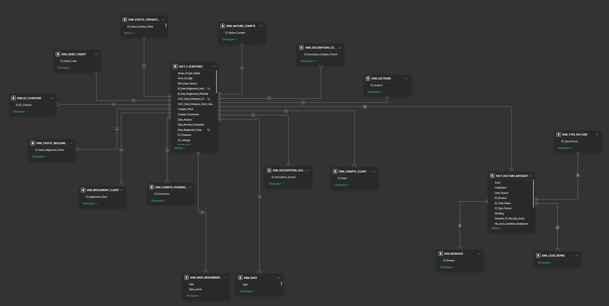
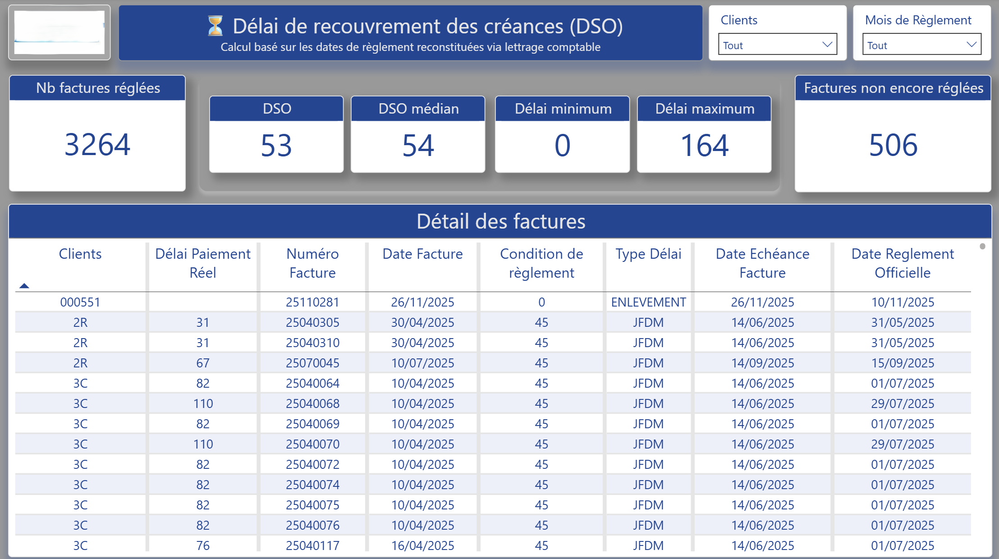
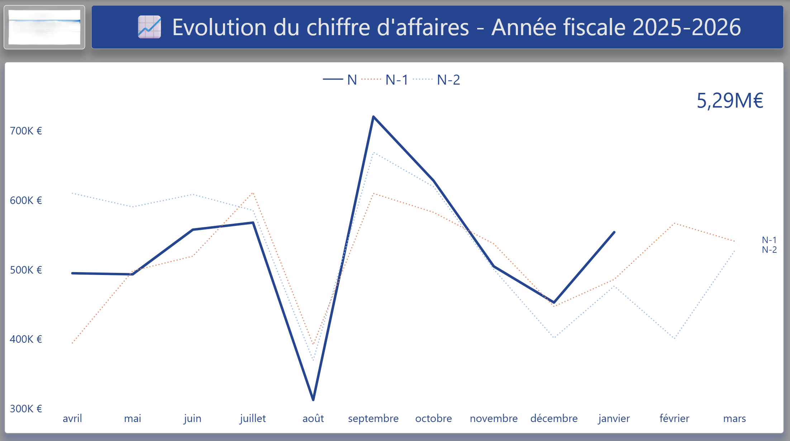

# 👋 Bonjour, je suis Aurélien Prat
## Business Intelligence Consultant | Data & Cloud

Conception d'architecture data **fiables**, **gouvernées** et **évolutives** pour le pilotage financier et opérationnel.

Du modèle métier à la plateforme data.

Spécialisation : Power BI | Dataiku DSS | Modélisation décisionnelle | Automatisation ETL | Architecture Data

---

## A propos de moi

Consultant BI orienté data et architecture, j'accompagne les PME et organisations dans la **structuration** de leur **écosystème data** :

- Centralisation des sources (ERP, Comptabilité, Production)
- Modélisation en étoile robuste
- Sécurisation des règles financières (DSO, SIG, YTD, N vs N-1)
- Préparation à la migration vers des architectures Cloud modernes (Azure / Fabric)

Objectif : transformer la donnée brute en outil de décision fiable.

Soft skills 
- x
- y

---

## 🔄 Double compétence : Business & Data

20 ans d’expérience terrain en retail et réseaux commerciaux.

Cette expérience nourrit aujourd'hui ma conception des modèles décisionnels.

- Pilotage d’activité
- Gestion d’indicateurs de performance
- Analyse de marges & rentabilité
- Management d’équipes
- Relation direction / terrain

---

## 🎯 Ce que j'apporte à une organisation

- 🏗 Structuration complète d'un système décisionnel
- 📊 Réduction des retraitements Excel manuels
- 🔍 Fiabilisation des règles de calcul métiers
- ⏱ Gain de temps sur le reporting fianncier
- ☁ Préparation à l'industrialisation Cloud

---

## 🏭 Réalisations marquantes

### Modernisation BI - PME industrielle

- Refonte complète du modèle Power BI

- Gestion avancée du lettrage comptable et DSO

- Implémentation de logiques YTD / N-1 / N-2 dynamiques

- Sécurisation des règles CE / SIG
- Mise en place d'une architecture prête pour Azure / Fabric

Résultat :
- 3 rapports stratégiques Power BI déployés
- Pilotage financier fiabilisé
- Indicateurs cohérents avec SAGE 100
- Réduction des erreurs liées aux retraitements manuels

---

## 📊 Spécialisation – Pilotage Financier sous Power BI

Conception et sécurisation d’architectures décisionnelles financières pour PME :

- Suivi Chiffre d’Affaires (N / N-1 / YTD dynamiques)
- Charges Externes & SIG
- Analyse DSO & délais clients
- Sécurisation des règles comptables (lettrage, dates de règlement reconstituées)
- Concordance avec Sage 100

Approche :
- Modélisation en étoile robuste
- Gouvernance des règles métier
- Automatisation des calculs complexes
- Préparation à une architecture Data Warehouse Azure

--- 

## 🧠 Vision architecture Data

  

Sources ERP / Comptabilité / Production  
↓  
Power Query / ETL Python  
↓  
Modèle en étoile (Star Schema)  
↓  
Data Warehouse (cible Azure SQL / Fabric)  
↓  
Power BI – Reporting & Pilotage 

Approche progressive : stabilisation du modèle on-premise → préparation migration Cloud

---

## 🛠 Stack technique

### 💻 Langages
- 'DAX'
- Power Query ('M')
- 'SQL'
- 'Python'
- 'Spark' (initiation via Fabric)

### ☁ Cloud & Data Platform
- Microsoft Azure (concept DW)
- Microsoft Fabric (Lakehouse | Data Warehouse)
- Modélisation OLAP
- Architecture décisionnelle

### 📊 Visualisation
- Power BI (modélisation avancée)
- Python (Matplotlib, Seaborn, Plotly)
- Dataiku DSS
- Data storytelling orienté décision

--- 

## 📊 Projets Data

### 🏢 Pilotage financier & DSO
Architecture complète du suivi CA, CE, SIG, DSO avec **règles métiers sécurisées**.

### 📈 Historisation Avancement Production
Snapshots automatisés via Python + intégration Power BI.

### ♟ Chess Analytics

> Chess.com Analytics est un projet data industrialisé combinant ingestion automatisée, transformation Python, validation CI/CD et exploitation BI, conçu comme un futur Data Product évolutif vers une architecture cloud.

[https://best-secure-14c.notion.site/OVERVIEW-30d2fd024ec38062a2ecd1b92c79eaa5?source=copy_link]

Architecture :
Ingestion automatisée → Transformation Python → Validation CI/CD → Exploitation BI

Développement en cours : PostgreSQL + Streamlit

### 🌱 ESG / CSRD Analytics

> Projet orienté conformité réglementaire (CSRD) et scoring ESG.

Approche : nettoyage multi-sources, gestion données bruitées, structuration pour reporting décisionnel.

[https://best-secure-14c.notion.site/Documentation-Client-2b72fd024ec3804884bdcce3c8edf04e?source=copy_link]

---

## 🏅 Certifications & Formation

Certification professionnelle Data Analyst, RNCP niveau 6 code NSF 326

Microsoft Fabric : Auto-formation (parcours en cours sur Microsoft Learn)

Dataiku DSS

---

## 📚 Documentation & Research
- Microsoft Fabric (résumé des modules d'apprentissage)
- Cheat Sheet PySpark | Lakehouse | Data Warehouse
- Règles d'or Power BI | Modélisation | Power Query
- Formules DAX

---

## 📬 Contact

📍 Bordeaux

🔗 LinkedIn : [www.linkedin.com/in/aurelien-prat]

✉️ Email : [apbi.consultant@gmail.com]

Ouvert aux opportunités CDI Data Analyst | BI | Data Paltform

Disponible pour missions de conseil via APBI Consulting

